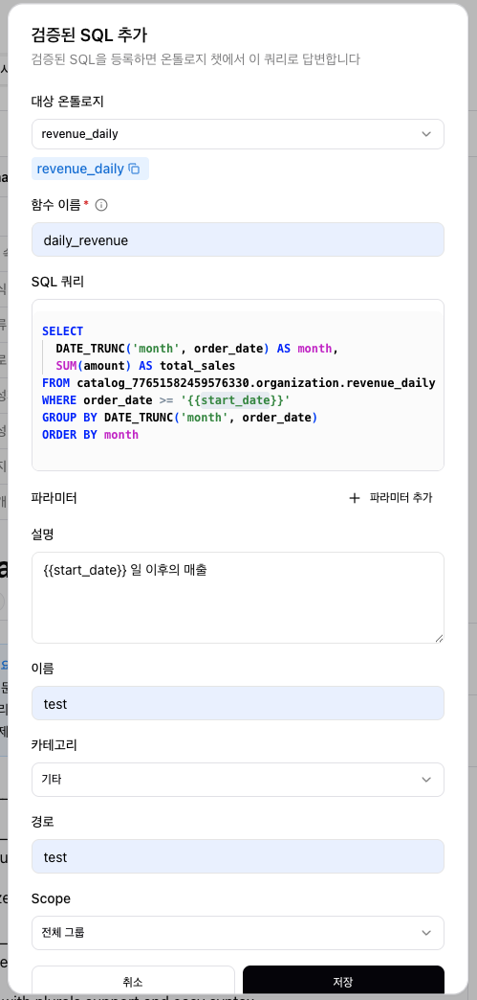
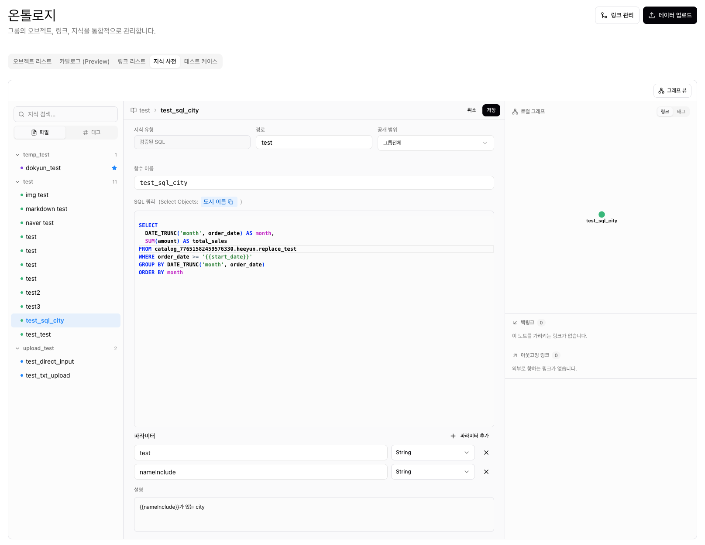

import { Callout } from 'nextra/components'

# 지식 사전 (Dictionary)

텍스트·파일·URL·이미지·검증된 SQL 기반 지식을 등록해 LLM이 참조하도록 사전화한다. 기존 Knowledge 문서를 대체하며 다중 소스 입력을 지원한다. 경로 `/ontology/dictionary`.

## 소스 유형

- **직접 입력 (Text)** — 지식 이름, 내용을 직접 작성.
- **파일 업로드 (File)** — `.csv`, `.xlsx`, `.jpg`, `.jpeg`, `.png` 등. 최대 파일 크기 제한 있음.
- **Web URL** — `http://` / `https://`로 시작하는 URL.
- **이미지 업로드 (Image)** — `.jpg`, `.jpeg`, `.png`.
- **검증된 SQL (SQL)** — Lake 온톨로지의 검증된 SparkSQL을 함수로 등록해 온톨로지 챗에서 재사용. 자세한 내용은 [검증된 SQL](#검증된-sql-sql) 참고.

## 메타데이터

- 이름 (Name)
- 카테고리 (Category) — `Metric Expression`, `Workflow`, `Source` 등 선택
- 태그 (Tag) — 쉼표 구분
- 경로 (Path) — 계층 구조 분류

> 모든 메타데이터는 지식 내용과 직접적으로 관련되도록 작성한다.

## 공개 범위 (Scope)

- Only Me (나에게만) — 본인만 활용한다.
- Entire Group (전체 그룹) — 같은 그룹 사용자 모두 활용한다.

## Base Knowledge

- Yes로 설정하면 LLM이 항상 우선 참조한다.
- No인 경우 사용자 질의 맥락에 따라 에이전트가 참조 여부를 판단한다.

## 자동 처리

- 생성·수정 후 일정 시간 이내에 AI 요약과 임베딩(Embedding)이 자동 생성된다.
- 요약·임베딩이 완료되어야 LLM 질의 시 정확히 검색된다.

## 운영 가이드

- 지식 삭제는 생성자만 수행할 수 있다.
- 처리 중 상태에서는 수정·삭제가 차단된다.

## 검증된 SQL (SQL)

검증된 SparkSQL 쿼리를 **함수(OntologyFunction)**로 등록한다. 등록하면 온톨로지 챗이 자연어 질문에 이 함수를 호출해 데이터를 조회하고 답변한다. 텍스트·파일 지식이 "참조 문서"라면, SQL 지식은 챗이 직접 실행하는 "데이터 조회 함수"다.

### 입력 항목

- **대상 온톨로지** — 쿼리가 실행될 Lake 온톨로지. JOIN 시 여러 개 선택 가능. 선택한 온톨로지 스키마 기반으로 테이블·컬럼 자동완성과 참조 검증이 동작한다.
- **함수 이름** — 챗(AI)이 함수를 인식·호출하는 식별자. 무엇을 조회하는지 드러나는 영문 `snake_case`로 작성한다. (예: `get_monthly_gmv_by_category`)
- **SQL 쿼리** — 실행할 SparkSQL. 동적 값은 `{{name}}` 형식의 파라미터로 표현한다.
- **설명** — 이 SQL이 "어떤 질문에 답하는지"를 적는다. 챗의 함수 검색 정확도를 좌우하는 핵심 항목이다.
- **파라미터** — `{{name}}` 에 대응하는 정의. 이름 / 타입(`String`·`Int`·`Boolean`·`Float`) / 설명으로 구성한다.

이름·카테고리·경로·공개 범위 등 메타데이터는 다른 소스 유형과 동일하게 작성한다.

### 작성 순서

1. **대상 온톨로지 선택** — 드롭다운에서 쿼리할 Lake 온톨로지를 고른다. 선택하면 그 아래에 파란 **뱃지**가 생성된다 (예: `도시 이름`).
2. **FQN 복사** — 뱃지를 클릭하면 SQL `FROM`/`JOIN` 에 그대로 붙여넣을 수 있는 **FQN(`catalog.schema.table`)** 이 클립보드에 복사된다. (뱃지에 마우스를 올리면 FQN이 툴팁으로 표시된다.)
3. **함수 이름 입력** — 영문 `snake_case` 식별자를 작성한다.
4. **SQL 작성** — 복사한 FQN을 `FROM` 절에 붙여넣고 쿼리를 완성한다. 동적 값은 `{{name}}` 형식으로 넣는다.
5. **파라미터 정의** — `파라미터 추가` 로 행을 추가하고, 쿼리에 쓴 `{{name}}` 과 동일한 이름·타입을 지정한다. 여러 개 추가하거나 `X` 로 삭제할 수 있다.
6. **설명·메타데이터 입력 후 저장** — 설명, 지식 이름, 카테고리, 경로, 공개 범위를 채우고 저장한다.



<Callout type="warning">
SparkSQL 규칙상 큰따옴표(`"`)와 백틱(`` ` ``)은 사용할 수 없다. 문자열은 작은따옴표(`'...'`)로 감싼다. 또한 `FROM`/`JOIN` 절의 테이블은 **선택한 대상 온톨로지에 존재하는 것만** 참조할 수 있다.
</Callout>

### 예시

```sql
-- 함수 이름: get_monthly_sales_total
-- 설명: 월별 전체 매출 합계. 매출 추이·리포트 질문에 사용.
SELECT
  DATE_TRUNC('month', order_date) AS month,
  SUM(amount) AS total_sales
FROM orders
WHERE order_date >= '{{start_date}}'
GROUP BY DATE_TRUNC('month', order_date)
ORDER BY month
```

- 파라미터: `start_date` (`String`) — 조회 시작일.

등록된 SQL 지식은 지식 사전 메인 화면에서 다른 지식과 함께 조회·편집할 수 있다. 상세 화면에서도 `SQL 쿼리` 라벨 옆의 `Select Objects` 뱃지로 FQN을 다시 복사할 수 있다.



## 파이프라인 연계

- 데이터프레임으로부터 대량 적재할 경우 [Upsert Knowledge](/pipeline/load-nodes/knowledge-upsert) 노드를 사용한다.
- 비정형 문서에서 자동 추출하려면 [Parse Pipeline 구성](/pipeline/parse-outputs/chain) 참고.
