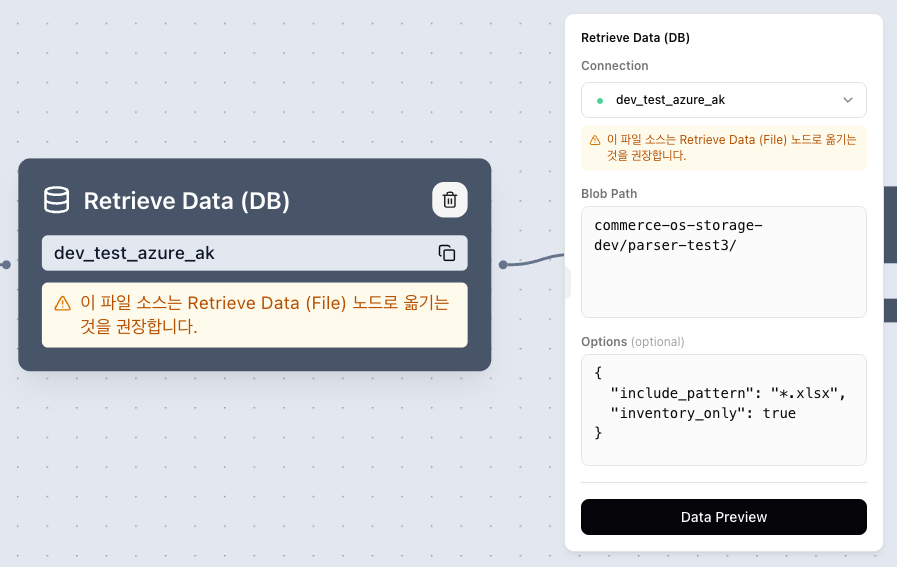

import { Callout } from 'nextra/components'

# 파일 커넥션 마이그레이션 가이드 (Legacy 파이프라인)

기존에 `Retrieve Data (DB)` 노드에 파일(스토리지) 커넥션을 설정해 둔 파이프라인을 `Retrieve Data (File)` 노드로 옮기는 방법을 안내한다.

## 왜 바뀌었나

이전에는 `Retrieve Data (DB)` 노드 하나가 DB·HTTP 쿼리 커넥션과 파일시스템(스토리지) 커넥션을 모두 처리했다. 이후 데이터 소스 노드의 책임이 분리되어, **파일시스템 소스는 신규 `Retrieve Data (File)` 노드가 전담**하고 `Retrieve Data (DB)` 노드는 DB/HTTP 쿼리 커넥션만 다루도록 변경되었다.

## 누가 영향을 받나

책임 분리 이전에 만들어진 파이프라인 중, `Retrieve Data (DB)` 노드에 **파일(스토리지) 커넥션**(예: `s3`, `azure_blob`, `azure_blob_ak`, `sharepoint`, `google_sheets`)을 설정해 둔 경우가 해당한다.

## 어떤 증상이 보이나

영향을 받는 노드는 편집 화면의 노드와 우측 설정 패널에 다음과 같은 경고가 표시된다.

> ⚠️ 이 파일 소스는 Retrieve Data (File) 노드로 옮기는 것을 권장합니다.

이 상태에서 배포를 시도하면 배포가 차단되며 다음 알림이 표시된다.

> Retrieve Data (DB) 노드가 파일(스토리지) 커넥션을 사용하고 있어 배포할 수 없습니다. 해당 노드를 Retrieve Data (File) 노드로 교체한 뒤 다시 배포해주세요.

## 해결 단계

1. **영향 노드 식별** — 경고가 표시된 `Retrieve Data (DB)` 노드와 그 노드에 설정된 파일 커넥션·경로·옵션을 확인한다.
2. **`Retrieve Data (File)` 노드 추가** — Extract 노드에서 `Retrieve Data (File)` 노드를 새로 추가한다.
3. **설정 이관** — 기존 노드의 값을 새 노드로 옮긴다.
   - Connection: 동일한 파일(스토리지) 커넥션 선택
   - Directory / File: 기존 경로(예: `s3://bucket/prefix/`)
   - Include Pattern / Exclude Pattern: 기존에 사용하던 파일명 glob 패턴
4. **엣지 재연결** — 기존 DB 노드의 후속 노드(Transform 등)로 향하던 연결을 새 `Retrieve Data (File)` 노드에서 다시 연결한다.
5. **기존 DB 노드 삭제** — 노드를 선택한 뒤 **Backspace** 키로 삭제한다.
6. **재배포** — 경고가 사라진 것을 확인한 뒤 다시 배포한다.

<Callout type="warning">
  - **자동 마이그레이션은 제공되지 않는다.** 위 절차에 따라 직접 노드를 교체해야 한다.
  - 교체 전까지는 해당 파이프라인을 **배포할 수 없다**.
  - 기존 파일 커넥션은 `Retrieve Data (DB)` 노드의 커넥션 드롭다운에서 신규로 선택할 수 없으며, 어떤 값이 설정돼 있는지 확인할 수 있도록 교체 안내용으로만 잔존 표시된다.
</Callout>
